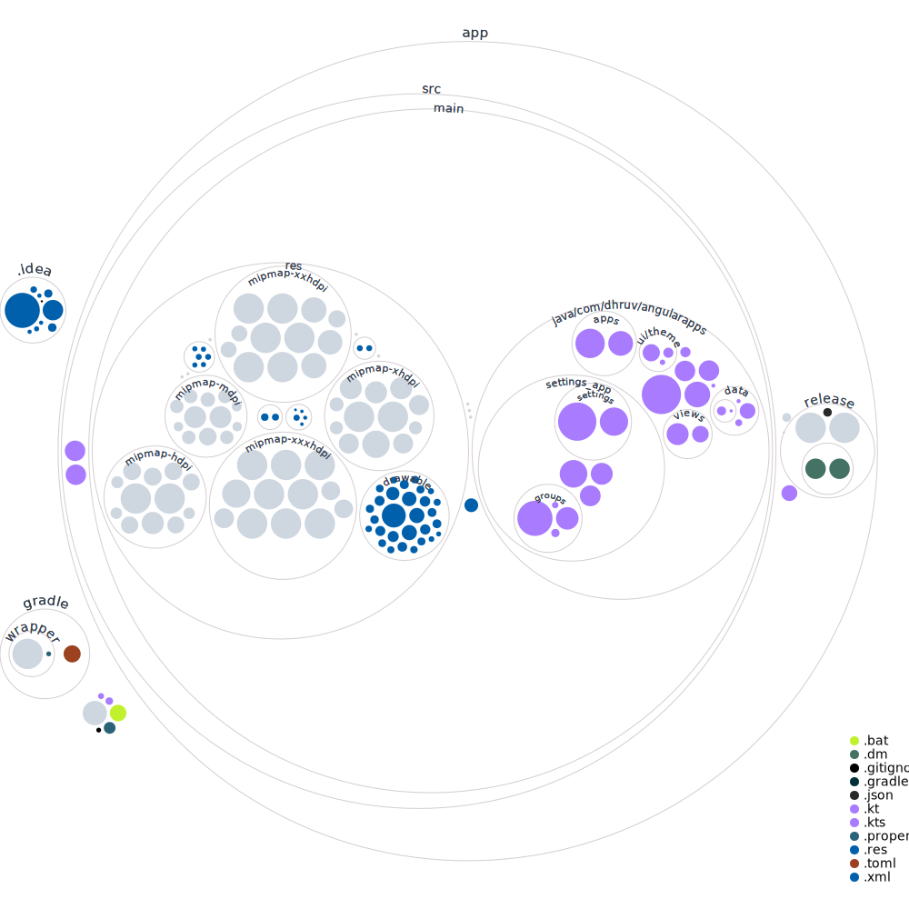

With this app you can group your most used apps and access them with just one gesture whenever you want.

### Access
You can get this app on play store ```link will be awailable soon```

### History
>This app was initially supposed to be an android launcher.
>
>built with the scope creep kincking in, It got bigger and bigger.

>This is one part of that extremely bloated android launcher used as a forground service.

## Some fun visualizations

### Code Volume Visualization


### Project Structure Visualization
<!---BETTER_FILES_TREE-->
```
┏ Angular-Apps━━━━━━━━━━━━━━━━━━━━━━━━━━━━━━━━━━━━━━━━━━━━━━━━━━┓
┣┏ better-tree━━━━━━━━━━━━━━━━━━━━━━━━━━━━━━━━━━━━━━━━━━━━━━━━┓ ┃
┃┣╭ .git────────────────────────────────────────────────────╮ ┃ ┃
┃┃├HEAD                                                     │ ┃ ┃
┃┃├┏ hooks━━━━━━━━━━━━━━━━━━━━┓                             │ ┃ ┃
┃┃│┣applypatch-msg.sample     ┃                             │ ┃ ┃
┃┃│┣update.sample             ┃                             │ ┃ ┃
┃┃│┣fsmonitor-watchman.sample ┃                             │ ┃ ┃
┃┃│┣pre-merge-commit.sample   ┃                             │ ┃ ┃
┃┃│┣pre-push.sample           ┃                             │ ┃ ┃
┃┃│┣commit-msg.sample         ┃                             │ ┃ ┃
┃┃│┣pre-commit.sample         ┃                             │ ┃ ┃
┃┃│┣pre-applypatch.sample     ┃                             │ ┃ ┃
┃┃│┣sendemail-validate.sample ┃                             │ ┃ ┃
┃┃│┣post-update.sample        ┃                             │ ┃ ┃
┃┃│┣prepare-commit-msg.sample ┃                             │ ┃ ┃
┃┃│┣push-to-checkout.sample   ┃                             │ ┃ ┃
┃┃│┣pre-receive.sample        ┃                             │ ┃ ┃
┃┃│┣pre-rebase.sample         ┃                             │ ┃ ┃
┃┃│┗━━━━━━━━━━━━━━━━━━━━━━━━━━┛                             │ ┃ ┃
┃┃├index                                                    │ ┃ ┃
┃┃├packed-refs                                              │ ┃ ┃
┃┃├┏ objects━━━━━━━━━━━━━━━━━━━━━━━━━━━━━━━━━━━━━━━━━━━━━━┓ │ ┃ ┃
┃┃│┣┏ info━┓                                              ┃ │ ┃ ┃
┃┃│┃┗━━━━━━┛                                              ┃ │ ┃ ┃
┃┃│┣┏ pack━━━━━━━━━━━━━━━━━━━━━━━━━━━━━━━━━━━━━━━━━━━━━━┓ ┃ │ ┃ ┃
┃┃│┃┣pack-ce23cddca46e699fa20fe0c8a9010ba80e56a8b2.idx  ┃ ┃ │ ┃ ┃
┃┃│┃┣pack-ce23cddca46e699fa20fe0c8a9010ba80e56a8b2.pack ┃ ┃ │ ┃ ┃
┃┃│┃┣pack-ce23cddca46e699fa20fe0c8a9010ba80e56a8b2.rev  ┃ ┃ │ ┃ ┃
┃┃│┃┗━━━━━━━━━━━━━━━━━━━━━━━━━━━━━━━━━━━━━━━━━━━━━━━━━━━┛ ┃ │ ┃ ┃
┃┃│┗━━━━━━━━━━━━━━━━━━━━━━━━━━━━━━━━━━━━━━━━━━━━━━━━━━━━━━┛ │ ┃ ┃
┃┃├┏ refs━━━━━━━━━┓                                         │ ┃ ┃
┃┃│┣┏ tags━┓      ┃                                         │ ┃ ┃
┃┃│┃┗━━━━━━┛      ┃                                         │ ┃ ┃
┃┃│┣┏ heads━┓     ┃                                         │ ┃ ┃
┃┃│┃┣main   ┃     ┃                                         │ ┃ ┃
┃┃│┃┗━━━━━━━┛     ┃                                         │ ┃ ┃
┃┃│┣┏ remotes━━━┓ ┃                                         │ ┃ ┃
┃┃│┃┣┏ origin━┓ ┃ ┃                                         │ ┃ ┃
┃┃│┃┃┣HEAD    ┃ ┃ ┃                                         │ ┃ ┃
┃┃│┃┃┗━━━━━━━━┛ ┃ ┃                                         │ ┃ ┃
┃┃│┃┗━━━━━━━━━━━┛ ┃                                         │ ┃ ┃
┃┃│┗━━━━━━━━━━━━━━┛                                         │ ┃ ┃
┃┃├┏ info━━━┓                                               │ ┃ ┃
┃┃│┣exclude ┃                                               │ ┃ ┃
┃┃│┗━━━━━━━━┛                                               │ ┃ ┃
┃┃├┏ logs━━━━━━━━━━━━┓                                      │ ┃ ┃
┃┃│┣HEAD             ┃                                      │ ┃ ┃
┃┃│┣┏ refs━━━━━━━━━┓ ┃                                      │ ┃ ┃
┃┃│┃┣┏ heads━┓     ┃ ┃                                      │ ┃ ┃
┃┃│┃┃┣main   ┃     ┃ ┃                                      │ ┃ ┃
┃┃│┃┃┗━━━━━━━┛     ┃ ┃                                      │ ┃ ┃
┃┃│┃┣┏ remotes━━━┓ ┃ ┃                                      │ ┃ ┃
┃┃│┃┃┣┏ origin━┓ ┃ ┃ ┃                                      │ ┃ ┃
┃┃│┃┃┃┣HEAD    ┃ ┃ ┃ ┃                                      │ ┃ ┃
┃┃│┃┃┃┗━━━━━━━━┛ ┃ ┃ ┃                                      │ ┃ ┃
┃┃│┃┃┗━━━━━━━━━━━┛ ┃ ┃                                      │ ┃ ┃
┃┃│┃┗━━━━━━━━━━━━━━┛ ┃                                      │ ┃ ┃
┃┃│┗━━━━━━━━━━━━━━━━━┛                                      │ ┃ ┃
┃┃├description                                              │ ┃ ┃
┃┃├config                                                   │ ┃ ┃
┃┃├┏ branches━┓                                             │ ┃ ┃
┃┃│┗━━━━━━━━━━┛                                             │ ┃ ┃
┃┃╰─────────────────────────────────────────────────────────╯ ┃ ┃
┃┣┏ executables━┓                                             ┃ ┃
┃┃┣better-tree  ┃                                             ┃ ┃
┃┃┗━━━━━━━━━━━━━┛                                             ┃ ┃
┃┣Cargo.lock                                                  ┃ ┃
┃┣README.md                                                   ┃ ┃
┃┣┏ src━━━━━┓                                                 ┃ ┃
┃┃┣main.rs  ┃                                                 ┃ ┃
┃┃┣style.rs ┃                                                 ┃ ┃
┃┃┗━━━━━━━━━┛                                                 ┃ ┃
┃┣Cargo.toml                                                  ┃ ┃
┃┣.gitignore                                                  ┃ ┃
┃┣╭ .github──────╮                                            ┃ ┃
┃┃├┏ workflows━┓ │                                            ┃ ┃
┃┃│┣build.yml  ┃ │                                            ┃ ┃
┃┃│┗━━━━━━━━━━━┛ │                                            ┃ ┃
┃┃╰──────────────╯                                            ┃ ┃
┃┗━━━━━━━━━━━━━━━━━━━━━━━━━━━━━━━━━━━━━━━━━━━━━━━━━━━━━━━━━━━━┛ ┃
┣┏ project━━━━━━━━━━━━━━━━━━━━━━━━━━━━━━━━━━━━━━━━━━━━━━━━━━━━┓ ┃
┃┣diagram.svg                                                 ┃ ┃
┃┣╭ .git────────────────────────────────────────────────────╮ ┃ ┃
┃┃├HEAD                                                     │ ┃ ┃
┃┃├┏ hooks━━━━━━━━━━━━━━━━━━━━┓                             │ ┃ ┃
┃┃│┣applypatch-msg.sample     ┃                             │ ┃ ┃
┃┃│┣update.sample             ┃                             │ ┃ ┃
┃┃│┣fsmonitor-watchman.sample ┃                             │ ┃ ┃
┃┃│┣pre-merge-commit.sample   ┃                             │ ┃ ┃
┃┃│┣pre-push.sample           ┃                             │ ┃ ┃
┃┃│┣commit-msg.sample         ┃                             │ ┃ ┃
┃┃│┣pre-commit.sample         ┃                             │ ┃ ┃
┃┃│┣pre-applypatch.sample     ┃                             │ ┃ ┃
┃┃│┣sendemail-validate.sample ┃                             │ ┃ ┃
┃┃│┣post-update.sample        ┃                             │ ┃ ┃
┃┃│┣prepare-commit-msg.sample ┃                             │ ┃ ┃
┃┃│┣push-to-checkout.sample   ┃                             │ ┃ ┃
┃┃│┣pre-receive.sample        ┃                             │ ┃ ┃
┃┃│┣pre-rebase.sample         ┃                             │ ┃ ┃
┃┃│┗━━━━━━━━━━━━━━━━━━━━━━━━━━┛                             │ ┃ ┃
┃┃├index                                                    │ ┃ ┃
┃┃├shallow                                                  │ ┃ ┃
┃┃├┏ objects━━━━━━━━━━━━━━━━━━━━━━━━━━━━━━━━━━━━━━━━━━━━━━┓ │ ┃ ┃
┃┃│┣┏ info━┓                                              ┃ │ ┃ ┃
┃┃│┃┗━━━━━━┛                                              ┃ │ ┃ ┃
┃┃│┣┏ pack━━━━━━━━━━━━━━━━━━━━━━━━━━━━━━━━━━━━━━━━━━━━━━┓ ┃ │ ┃ ┃
┃┃│┃┣pack-b217eb0737dd1e8cf105ab0ac39a89ef63477efc.rev  ┃ ┃ │ ┃ ┃
┃┃│┃┣pack-b217eb0737dd1e8cf105ab0ac39a89ef63477efc.pack ┃ ┃ │ ┃ ┃
┃┃│┃┣pack-b217eb0737dd1e8cf105ab0ac39a89ef63477efc.idx  ┃ ┃ │ ┃ ┃
┃┃│┃┗━━━━━━━━━━━━━━━━━━━━━━━━━━━━━━━━━━━━━━━━━━━━━━━━━━━┛ ┃ │ ┃ ┃
┃┃│┗━━━━━━━━━━━━━━━━━━━━━━━━━━━━━━━━━━━━━━━━━━━━━━━━━━━━━━┛ │ ┃ ┃
┃┃├┏ refs━━━━━━━━━┓                                         │ ┃ ┃
┃┃│┣┏ tags━┓      ┃                                         │ ┃ ┃
┃┃│┃┗━━━━━━┛      ┃                                         │ ┃ ┃
┃┃│┣┏ heads━┓     ┃                                         │ ┃ ┃
┃┃│┃┣master ┃     ┃                                         │ ┃ ┃
┃┃│┃┗━━━━━━━┛     ┃                                         │ ┃ ┃
┃┃│┣┏ remotes━━━┓ ┃                                         │ ┃ ┃
┃┃│┃┣┏ origin━┓ ┃ ┃                                         │ ┃ ┃
┃┃│┃┃┣master  ┃ ┃ ┃                                         │ ┃ ┃
┃┃│┃┃┗━━━━━━━━┛ ┃ ┃                                         │ ┃ ┃
┃┃│┃┗━━━━━━━━━━━┛ ┃                                         │ ┃ ┃
┃┃│┗━━━━━━━━━━━━━━┛                                         │ ┃ ┃
┃┃├┏ info━━━┓                                               │ ┃ ┃
┃┃│┣exclude ┃                                               │ ┃ ┃
┃┃│┗━━━━━━━━┛                                               │ ┃ ┃
┃┃├┏ logs━━━━━━━━━━━━┓                                      │ ┃ ┃
┃┃│┣HEAD             ┃                                      │ ┃ ┃
┃┃│┣┏ refs━━━━━━━━━┓ ┃                                      │ ┃ ┃
┃┃│┃┣┏ heads━┓     ┃ ┃                                      │ ┃ ┃
┃┃│┃┃┣master ┃     ┃ ┃                                      │ ┃ ┃
┃┃│┃┃┗━━━━━━━┛     ┃ ┃                                      │ ┃ ┃
┃┃│┃┣┏ remotes━━━┓ ┃ ┃                                      │ ┃ ┃
┃┃│┃┃┣┏ origin━┓ ┃ ┃ ┃                                      │ ┃ ┃
┃┃│┃┃┃┣master  ┃ ┃ ┃ ┃                                      │ ┃ ┃
┃┃│┃┃┃┗━━━━━━━━┛ ┃ ┃ ┃                                      │ ┃ ┃
┃┃│┃┃┗━━━━━━━━━━━┛ ┃ ┃                                      │ ┃ ┃
┃┃│┃┗━━━━━━━━━━━━━━┛ ┃                                      │ ┃ ┃
┃┃│┗━━━━━━━━━━━━━━━━━┛                                      │ ┃ ┃
┃┃├description                                              │ ┃ ┃
┃┃├config                                                   │ ┃ ┃
┃┃├┏ branches━┓                                             │ ┃ ┃
┃┃│┗━━━━━━━━━━┛                                             │ ┃ ┃
┃┃├FETCH_HEAD                                               │ ┃ ┃
┃┃╰─────────────────────────────────────────────────────────╯ ┃ ┃
┃┣settings.gradle.kts                                         ┃ ┃
┃┣gradlew.bat                                                 ┃ ┃
┃┣gradlew                                                     ┃ ┃
┃┣┏ gradle━━━━━━━━━━━━━━━━━━━━━━┓                             ┃ ┃
┃┃┣libs.versions.toml           ┃                             ┃ ┃
┃┃┣┏ wrapper━━━━━━━━━━━━━━━━━━┓ ┃                             ┃ ┃
┃┃┃┣gradle-wrapper.properties ┃ ┃                             ┃ ┃
┃┃┃┣gradle-wrapper.jar        ┃ ┃                             ┃ ┃
┃┃┃┗━━━━━━━━━━━━━━━━━━━━━━━━━━┛ ┃                             ┃ ┃
┃┃┗━━━━━━━━━━━━━━━━━━━━━━━━━━━━━┛                             ┃ ┃
┃┣README.md                                                   ┃ ┃
┃┣.gitignore                                                  ┃ ┃
┃┣┏ app━━━━━━━━━━━━━━━━━━━━━━━━━━━━━━━━━━━━━━━━━━┓            ┃ ┃
┃┃┣proguard-rules.pro                            ┃            ┃ ┃
┃┃┣┏ src━━━━━━━━━━━━━━━━━━━━━━━━━━━━━━━━━━━━━━━┓ ┃            ┃ ┃
┃┃┃┣┏ test━━━━━━━━━━━━━━━━━━━━━━━━━━┓          ┃ ┃            ┃ ┃
┃┃┃┃┣┏ java━━━━━━━━━━━━━━━━━━━━━━━┓ ┃          ┃ ┃            ┃ ┃
┃┃┃┃┃┣┏ com━━━━━━━━━━━━━━━━━━━━━┓ ┃ ┃          ┃ ┃            ┃ ┃
┃┃┃┃┃┃┣┏ dhruv━━━━━━━━━━━━━━━━┓ ┃ ┃ ┃          ┃ ┃            ┃ ┃
┃┃┃┃┃┃┃┣┏ angularapps━━━━━━━┓ ┃ ┃ ┃ ┃          ┃ ┃            ┃ ┃
┃┃┃┃┃┃┃┃┣ExampleUnitTest.kt ┃ ┃ ┃ ┃ ┃          ┃ ┃            ┃ ┃
┃┃┃┃┃┃┃┃┗━━━━━━━━━━━━━━━━━━━┛ ┃ ┃ ┃ ┃          ┃ ┃            ┃ ┃
┃┃┃┃┃┃┃┗━━━━━━━━━━━━━━━━━━━━━━┛ ┃ ┃ ┃          ┃ ┃            ┃ ┃
┃┃┃┃┃┃┗━━━━━━━━━━━━━━━━━━━━━━━━━┛ ┃ ┃          ┃ ┃            ┃ ┃
┃┃┃┃┃┗━━━━━━━━━━━━━━━━━━━━━━━━━━━━┛ ┃          ┃ ┃            ┃ ┃
┃┃┃┃┗━━━━━━━━━━━━━━━━━━━━━━━━━━━━━━━┛          ┃ ┃            ┃ ┃
┃┃┃┣┏ androidTest━━━━━━━━━━━━━━━━━━━━━━━━━━━┓  ┃ ┃            ┃ ┃
┃┃┃┃┣┏ java━━━━━━━━━━━━━━━━━━━━━━━━━━━━━━━┓ ┃  ┃ ┃            ┃ ┃
┃┃┃┃┃┣┏ com━━━━━━━━━━━━━━━━━━━━━━━━━━━━━┓ ┃ ┃  ┃ ┃            ┃ ┃
┃┃┃┃┃┃┣┏ dhruv━━━━━━━━━━━━━━━━━━━━━━━━┓ ┃ ┃ ┃  ┃ ┃            ┃ ┃
┃┃┃┃┃┃┃┣┏ angularapps━━━━━━━━━━━━━━━┓ ┃ ┃ ┃ ┃  ┃ ┃            ┃ ┃
┃┃┃┃┃┃┃┃┣ExampleInstrumentedTest.kt ┃ ┃ ┃ ┃ ┃  ┃ ┃            ┃ ┃
┃┃┃┃┃┃┃┃┗━━━━━━━━━━━━━━━━━━━━━━━━━━━┛ ┃ ┃ ┃ ┃  ┃ ┃            ┃ ┃
┃┃┃┃┃┃┃┗━━━━━━━━━━━━━━━━━━━━━━━━━━━━━━┛ ┃ ┃ ┃  ┃ ┃            ┃ ┃
┃┃┃┃┃┃┗━━━━━━━━━━━━━━━━━━━━━━━━━━━━━━━━━┛ ┃ ┃  ┃ ┃            ┃ ┃
┃┃┃┃┃┗━━━━━━━━━━━━━━━━━━━━━━━━━━━━━━━━━━━━┛ ┃  ┃ ┃            ┃ ┃
┃┃┃┃┗━━━━━━━━━━━━━━━━━━━━━━━━━━━━━━━━━━━━━━━┛  ┃ ┃            ┃ ┃
┃┃┃┣┏ main━━━━━━━━━━━━━━━━━━━━━━━━━━━━━━━━━━━┓ ┃ ┃            ┃ ┃
┃┃┃┃┣g_ic_app-playstore.png                  ┃ ┃ ┃            ┃ ┃
┃┃┃┃┣┏ java━━━━━━━━━━━━━━━━━━━━━━━━━━━━━━━┓  ┃ ┃ ┃            ┃ ┃
┃┃┃┃┃┣┏ com━━━━━━━━━━━━━━━━━━━━━━━━━━━━━┓ ┃  ┃ ┃ ┃            ┃ ┃
┃┃┃┃┃┃┣┏ dhruv━━━━━━━━━━━━━━━━━━━━━━━━┓ ┃ ┃  ┃ ┃ ┃            ┃ ┃
┃┃┃┃┃┃┃┣┏ angularapps━━━━━━━━━━━━━━━┓ ┃ ┃ ┃  ┃ ┃ ┃            ┃ ┃
┃┃┃┃┃┃┃┃┣AnimatedFloat.kt           ┃ ┃ ┃ ┃  ┃ ┃ ┃            ┃ ┃
┃┃┃┃┃┃┃┃┣┏ apps━━━━━━━━━━━━━━━━━━━┓ ┃ ┃ ┃ ┃  ┃ ┃ ┃            ┃ ┃
┃┃┃┃┃┃┃┃┃┣AppManager.kt           ┃ ┃ ┃ ┃ ┃  ┃ ┃ ┃            ┃ ┃
┃┃┃┃┃┃┃┃┃┣AppsIconsPositioning.kt ┃ ┃ ┃ ┃ ┃  ┃ ┃ ┃            ┃ ┃
┃┃┃┃┃┃┃┃┃┗━━━━━━━━━━━━━━━━━━━━━━━━┛ ┃ ┃ ┃ ┃  ┃ ┃ ┃            ┃ ┃
┃┃┃┃┃┃┃┃┣┏ utils━━━━━━━━━━━━━┓      ┃ ┃ ┃ ┃  ┃ ┃ ┃            ┃ ┃
┃┃┃┃┃┃┃┃┃┣DrawablePainter.kt ┃      ┃ ┃ ┃ ┃  ┃ ┃ ┃            ┃ ┃
┃┃┃┃┃┃┃┃┃┗━━━━━━━━━━━━━━━━━━━┛      ┃ ┃ ┃ ┃  ┃ ┃ ┃            ┃ ┃
┃┃┃┃┃┃┃┃┣┏ settings_app━━━━━━━━┓    ┃ ┃ ┃ ┃  ┃ ┃ ┃            ┃ ┃
┃┃┃┃┃┃┃┃┃┣┏ settings━━━━━┓     ┃    ┃ ┃ ┃ ┃  ┃ ┃ ┃            ┃ ┃
┃┃┃┃┃┃┃┃┃┃┣SettingsVM.kt ┃     ┃    ┃ ┃ ┃ ┃  ┃ ┃ ┃            ┃ ┃
┃┃┃┃┃┃┃┃┃┃┣Settings.kt   ┃     ┃    ┃ ┃ ┃ ┃  ┃ ┃ ┃            ┃ ┃
┃┃┃┃┃┃┃┃┃┃┗━━━━━━━━━━━━━━┛     ┃    ┃ ┃ ┃ ┃  ┃ ┃ ┃            ┃ ┃
┃┃┃┃┃┃┃┃┃┣Home.kt              ┃    ┃ ┃ ┃ ┃  ┃ ┃ ┃            ┃ ┃
┃┃┃┃┃┃┃┃┃┣SettingsArt.kt       ┃    ┃ ┃ ┃ ┃  ┃ ┃ ┃            ┃ ┃
┃┃┃┃┃┃┃┃┃┣┏ groups━━━━━━━━━━━┓ ┃    ┃ ┃ ┃ ┃  ┃ ┃ ┃            ┃ ┃
┃┃┃┃┃┃┃┃┃┃┣GroupsManager.kt  ┃ ┃    ┃ ┃ ┃ ┃  ┃ ┃ ┃            ┃ ┃
┃┃┃┃┃┃┃┃┃┃┣GroupsEditorVM.kt ┃ ┃    ┃ ┃ ┃ ┃  ┃ ┃ ┃            ┃ ┃
┃┃┃┃┃┃┃┃┃┃┣GroupIcons.kt     ┃ ┃    ┃ ┃ ┃ ┃  ┃ ┃ ┃            ┃ ┃
┃┃┃┃┃┃┃┃┃┃┣GroupsEditor.kt   ┃ ┃    ┃ ┃ ┃ ┃  ┃ ┃ ┃            ┃ ┃
┃┃┃┃┃┃┃┃┃┃┗━━━━━━━━━━━━━━━━━━┛ ┃    ┃ ┃ ┃ ┃  ┃ ┃ ┃            ┃ ┃
┃┃┃┃┃┃┃┃┃┣SettingsApp.kt       ┃    ┃ ┃ ┃ ┃  ┃ ┃ ┃            ┃ ┃
┃┃┃┃┃┃┃┃┃┗━━━━━━━━━━━━━━━━━━━━━┛    ┃ ┃ ┃ ┃  ┃ ┃ ┃            ┃ ┃
┃┃┃┃┃┃┃┃┣┏ di━━━━━━━━━━┓            ┃ ┃ ┃ ┃  ┃ ┃ ┃            ┃ ┃
┃┃┃┃┃┃┃┃┃┣AppModule.kt ┃            ┃ ┃ ┃ ┃  ┃ ┃ ┃            ┃ ┃
┃┃┃┃┃┃┃┃┃┗━━━━━━━━━━━━━┛            ┃ ┃ ┃ ┃  ┃ ┃ ┃            ┃ ┃
┃┃┃┃┃┃┃┃┣┏ ui━━━━━━━━━┓             ┃ ┃ ┃ ┃  ┃ ┃ ┃            ┃ ┃
┃┃┃┃┃┃┃┃┃┣┏ theme━━━┓ ┃             ┃ ┃ ┃ ┃  ┃ ┃ ┃            ┃ ┃
┃┃┃┃┃┃┃┃┃┃┣Type.kt  ┃ ┃             ┃ ┃ ┃ ┃  ┃ ┃ ┃            ┃ ┃
┃┃┃┃┃┃┃┃┃┃┣Color.kt ┃ ┃             ┃ ┃ ┃ ┃  ┃ ┃ ┃            ┃ ┃
┃┃┃┃┃┃┃┃┃┃┣Theme.kt ┃ ┃             ┃ ┃ ┃ ┃  ┃ ┃ ┃            ┃ ┃
┃┃┃┃┃┃┃┃┃┃┗━━━━━━━━━┛ ┃             ┃ ┃ ┃ ┃  ┃ ┃ ┃            ┃ ┃
┃┃┃┃┃┃┃┃┃┗━━━━━━━━━━━━┛             ┃ ┃ ┃ ┃  ┃ ┃ ┃            ┃ ┃
┃┃┃┃┃┃┃┃┣┏ views━━━━━━━━━━━━━━━━━━┓ ┃ ┃ ┃ ┃  ┃ ┃ ┃            ┃ ┃
┃┃┃┃┃┃┃┃┃┣SliderView.kt           ┃ ┃ ┃ ┃ ┃  ┃ ┃ ┃            ┃ ┃
┃┃┃┃┃┃┃┃┃┣PositionedLayoutView.kt ┃ ┃ ┃ ┃ ┃  ┃ ┃ ┃            ┃ ┃
┃┃┃┃┃┃┃┃┃┗━━━━━━━━━━━━━━━━━━━━━━━━┛ ┃ ┃ ┃ ┃  ┃ ┃ ┃            ┃ ┃
┃┃┃┃┃┃┃┃┣OverlayService.kt          ┃ ┃ ┃ ┃  ┃ ┃ ┃            ┃ ┃
┃┃┃┃┃┃┃┃┣MainActivity.kt            ┃ ┃ ┃ ┃  ┃ ┃ ┃            ┃ ┃
┃┃┃┃┃┃┃┃┣┏ data━━━━━━━━━━━┓         ┃ ┃ ┃ ┃  ┃ ┃ ┃            ┃ ┃
┃┃┃┃┃┃┃┃┃┣UserPrefImpl.kt ┃         ┃ ┃ ┃ ┃  ┃ ┃ ┃            ┃ ┃
┃┃┃┃┃┃┃┃┃┣┏ models━━━━━┓  ┃         ┃ ┃ ┃ ┃  ┃ ┃ ┃            ┃ ┃
┃┃┃┃┃┃┃┃┃┃┣Position.kt ┃  ┃         ┃ ┃ ┃ ┃  ┃ ┃ ┃            ┃ ┃
┃┃┃┃┃┃┃┃┃┃┣Group.kt    ┃  ┃         ┃ ┃ ┃ ┃  ┃ ┃ ┃            ┃ ┃
┃┃┃┃┃┃┃┃┃┃┗━━━━━━━━━━━━┛  ┃         ┃ ┃ ┃ ┃  ┃ ┃ ┃            ┃ ┃
┃┃┃┃┃┃┃┃┃┣Breaks.kt       ┃         ┃ ┃ ┃ ┃  ┃ ┃ ┃            ┃ ┃
┃┃┃┃┃┃┃┃┃┣UserPref.kt     ┃         ┃ ┃ ┃ ┃  ┃ ┃ ┃            ┃ ┃
┃┃┃┃┃┃┃┃┃┗━━━━━━━━━━━━━━━━┛         ┃ ┃ ┃ ┃  ┃ ┃ ┃            ┃ ┃
┃┃┃┃┃┃┃┃┣MyApp.kt                   ┃ ┃ ┃ ┃  ┃ ┃ ┃            ┃ ┃
┃┃┃┃┃┃┃┃┗━━━━━━━━━━━━━━━━━━━━━━━━━━━┛ ┃ ┃ ┃  ┃ ┃ ┃            ┃ ┃
┃┃┃┃┃┃┃┗━━━━━━━━━━━━━━━━━━━━━━━━━━━━━━┛ ┃ ┃  ┃ ┃ ┃            ┃ ┃
┃┃┃┃┃┃┗━━━━━━━━━━━━━━━━━━━━━━━━━━━━━━━━━┛ ┃  ┃ ┃ ┃            ┃ ┃
┃┃┃┃┃┗━━━━━━━━━━━━━━━━━━━━━━━━━━━━━━━━━━━━┛  ┃ ┃ ┃            ┃ ┃
┃┃┃┃┣ic_flat_app-playstore.png               ┃ ┃ ┃            ┃ ┃
┃┃┃┃┣┏ res━━━━━━━━━━━━━━━━━━━━━━━━━━━━━━━━━┓ ┃ ┃ ┃            ┃ ┃
┃┃┃┃┃┣┏ drawable-xhdpi━━━━━━━━━┓           ┃ ┃ ┃ ┃            ┃ ┃
┃┃┃┃┃┃┣ic_app_notification.png ┃           ┃ ┃ ┃ ┃            ┃ ┃
┃┃┃┃┃┃┗━━━━━━━━━━━━━━━━━━━━━━━━┛           ┃ ┃ ┃ ┃            ┃ ┃
┃┃┃┃┃┣┏ values━━━━━━━━━━━━━━━━━━━━┓        ┃ ┃ ┃ ┃            ┃ ┃
┃┃┃┃┃┃┣ic_app_background.xml      ┃        ┃ ┃ ┃ ┃            ┃ ┃
┃┃┃┃┃┃┣ic_flat_app_background.xml ┃        ┃ ┃ ┃ ┃            ┃ ┃
┃┃┃┃┃┃┣themes.xml                 ┃        ┃ ┃ ┃ ┃            ┃ ┃
┃┃┃┃┃┃┣strings.xml                ┃        ┃ ┃ ┃ ┃            ┃ ┃
┃┃┃┃┃┃┣colors.xml                 ┃        ┃ ┃ ┃ ┃            ┃ ┃
┃┃┃┃┃┃┗━━━━━━━━━━━━━━━━━━━━━━━━━━━┛        ┃ ┃ ┃ ┃            ┃ ┃
┃┃┃┃┃┣┏ drawable-hdpi━━━━━━━━━━┓           ┃ ┃ ┃ ┃            ┃ ┃
┃┃┃┃┃┃┣ic_app_notification.png ┃           ┃ ┃ ┃ ┃            ┃ ┃
┃┃┃┃┃┃┗━━━━━━━━━━━━━━━━━━━━━━━━┛           ┃ ┃ ┃ ┃            ┃ ┃
┃┃┃┃┃┣┏ drawable-xxxhdpi━━━━━━━┓           ┃ ┃ ┃ ┃            ┃ ┃
┃┃┃┃┃┃┣ic_app_notification.png ┃           ┃ ┃ ┃ ┃            ┃ ┃
┃┃┃┃┃┃┗━━━━━━━━━━━━━━━━━━━━━━━━┛           ┃ ┃ ┃ ┃            ┃ ┃
┃┃┃┃┃┣┏ mipmap-anydpi-v26━━━━┓             ┃ ┃ ┃ ┃            ┃ ┃
┃┃┃┃┃┃┣ic_app.xml            ┃             ┃ ┃ ┃ ┃            ┃ ┃
┃┃┃┃┃┃┣g_ic_app.xml          ┃             ┃ ┃ ┃ ┃            ┃ ┃
┃┃┃┃┃┃┣ic_flat_app_round.xml ┃             ┃ ┃ ┃ ┃            ┃ ┃
┃┃┃┃┃┃┣ic_app_round.xml      ┃             ┃ ┃ ┃ ┃            ┃ ┃
┃┃┃┃┃┃┣ic_flat_app.xml       ┃             ┃ ┃ ┃ ┃            ┃ ┃
┃┃┃┃┃┃┣g_ic_app_round.xml    ┃             ┃ ┃ ┃ ┃            ┃ ┃
┃┃┃┃┃┃┗━━━━━━━━━━━━━━━━━━━━━━┛             ┃ ┃ ┃ ┃            ┃ ┃
┃┃┃┃┃┣┏ xml━━━━━━━━━━━━━━━━━━━━━━┓         ┃ ┃ ┃ ┃            ┃ ┃
┃┃┃┃┃┃┣backup_rules.xml          ┃         ┃ ┃ ┃ ┃            ┃ ┃
┃┃┃┃┃┃┣data_extraction_rules.xml ┃         ┃ ┃ ┃ ┃            ┃ ┃
┃┃┃┃┃┃┗━━━━━━━━━━━━━━━━━━━━━━━━━━┛         ┃ ┃ ┃ ┃            ┃ ┃
┃┃┃┃┃┣┏ mipmap-anydpi━━━━━━━━┓             ┃ ┃ ┃ ┃            ┃ ┃
┃┃┃┃┃┃┣ic_launcher_round.xml ┃             ┃ ┃ ┃ ┃            ┃ ┃
┃┃┃┃┃┃┣ic_launcher.xml       ┃             ┃ ┃ ┃ ┃            ┃ ┃
┃┃┃┃┃┃┗━━━━━━━━━━━━━━━━━━━━━━┛             ┃ ┃ ┃ ┃            ┃ ┃
┃┃┃┃┃┣┏ drawable━━━━━━━━━━━━━━━━━━━━━━━━━┓ ┃ ┃ ┃ ┃            ┃ ┃
┃┃┃┃┃┃┣round_arrow_outward_24.xml        ┃ ┃ ┃ ┃ ┃            ┃ ┃
┃┃┃┃┃┃┣round_games_24.xml                ┃ ┃ ┃ ┃ ┃            ┃ ┃
┃┃┃┃┃┃┣outline_sticky_note_2_24.xml      ┃ ┃ ┃ ┃ ┃            ┃ ┃
┃┃┃┃┃┃┣round_group_24.xml                ┃ ┃ ┃ ┃ ┃            ┃ ┃
┃┃┃┃┃┃┣round_swipe_vertical_24.xml       ┃ ┃ ┃ ┃ ┃            ┃ ┃
┃┃┃┃┃┃┣outline_settings_24.xml           ┃ ┃ ┃ ┃ ┃            ┃ ┃
┃┃┃┃┃┃┣round_apps_24.xml                 ┃ ┃ ┃ ┃ ┃            ┃ ┃
┃┃┃┃┃┃┣outline_home_24.xml               ┃ ┃ ┃ ┃ ┃            ┃ ┃
┃┃┃┃┃┃┣ic_flat_app_foreground.xml        ┃ ┃ ┃ ┃ ┃            ┃ ┃
┃┃┃┃┃┃┣round_open_in_full_24.xml         ┃ ┃ ┃ ┃ ┃            ┃ ┃
┃┃┃┃┃┃┣ic_app_foreground.xml             ┃ ┃ ┃ ┃ ┃            ┃ ┃
┃┃┃┃┃┃┣round_lock_24.xml                 ┃ ┃ ┃ ┃ ┃            ┃ ┃
┃┃┃┃┃┃┣baseline_group_work_24.xml        ┃ ┃ ┃ ┃ ┃            ┃ ┃
┃┃┃┃┃┃┣round_location_searching_24.xml   ┃ ┃ ┃ ┃ ┃            ┃ ┃
┃┃┃┃┃┃┣ic_launcher_foreground.xml        ┃ ┃ ┃ ┃ ┃            ┃ ┃
┃┃┃┃┃┃┣round_pan_tool_alt_24.xml         ┃ ┃ ┃ ┃ ┃            ┃ ┃
┃┃┃┃┃┃┣round_wallet_24.xml               ┃ ┃ ┃ ┃ ┃            ┃ ┃
┃┃┃┃┃┃┣round_personal_video_24.xml       ┃ ┃ ┃ ┃ ┃            ┃ ┃
┃┃┃┃┃┃┣baseline_settings_24.xml          ┃ ┃ ┃ ┃ ┃            ┃ ┃
┃┃┃┃┃┃┣round_report_gmailerrorred_24.xml ┃ ┃ ┃ ┃ ┃            ┃ ┃
┃┃┃┃┃┃┣round_looks_24.xml                ┃ ┃ ┃ ┃ ┃            ┃ ┃
┃┃┃┃┃┃┣ic_transparent_background.xml     ┃ ┃ ┃ ┃ ┃            ┃ ┃
┃┃┃┃┃┃┣round_travel_explore_24.xml       ┃ ┃ ┃ ┃ ┃            ┃ ┃
┃┃┃┃┃┃┣baseline_music_note_24.xml        ┃ ┃ ┃ ┃ ┃            ┃ ┃
┃┃┃┃┃┃┣baseline_home_24.xml              ┃ ┃ ┃ ┃ ┃            ┃ ┃
┃┃┃┃┃┃┣round_work_24.xml                 ┃ ┃ ┃ ┃ ┃            ┃ ┃
┃┃┃┃┃┃┣round_fitness_center_24.xml       ┃ ┃ ┃ ┃ ┃            ┃ ┃
┃┃┃┃┃┃┣ic_launcher_background.xml        ┃ ┃ ┃ ┃ ┃            ┃ ┃
┃┃┃┃┃┃┣outline_group_work_24.xml         ┃ ┃ ┃ ┃ ┃            ┃ ┃
┃┃┃┃┃┃┗━━━━━━━━━━━━━━━━━━━━━━━━━━━━━━━━━━┛ ┃ ┃ ┃ ┃            ┃ ┃
┃┃┃┃┃┣┏ mipmap-xxxhdpi━━━━━━━━━━┓          ┃ ┃ ┃ ┃            ┃ ┃
┃┃┃┃┃┃┣ic_launcher.webp         ┃          ┃ ┃ ┃ ┃            ┃ ┃
┃┃┃┃┃┃┣ic_app.webp              ┃          ┃ ┃ ┃ ┃            ┃ ┃
┃┃┃┃┃┃┣ic_flat_app.webp         ┃          ┃ ┃ ┃ ┃            ┃ ┃
┃┃┃┃┃┃┣ic_app_foreground.webp   ┃          ┃ ┃ ┃ ┃            ┃ ┃
┃┃┃┃┃┃┣g_ic_app_background.webp ┃          ┃ ┃ ┃ ┃            ┃ ┃
┃┃┃┃┃┃┣g_ic_app.webp            ┃          ┃ ┃ ┃ ┃            ┃ ┃
┃┃┃┃┃┃┣ic_flat_app_round.webp   ┃          ┃ ┃ ┃ ┃            ┃ ┃
┃┃┃┃┃┃┣g_ic_app_foreground.webp ┃          ┃ ┃ ┃ ┃            ┃ ┃
┃┃┃┃┃┃┣ic_app_round.webp        ┃          ┃ ┃ ┃ ┃            ┃ ┃
┃┃┃┃┃┃┣g_ic_app_round.webp      ┃          ┃ ┃ ┃ ┃            ┃ ┃
┃┃┃┃┃┃┣ic_app_background.webp   ┃          ┃ ┃ ┃ ┃            ┃ ┃
┃┃┃┃┃┃┣ic_launcher_round.webp   ┃          ┃ ┃ ┃ ┃            ┃ ┃
┃┃┃┃┃┃┗━━━━━━━━━━━━━━━━━━━━━━━━━┛          ┃ ┃ ┃ ┃            ┃ ┃
┃┃┃┃┃┣┏ mipmap-mdpi━━━━━━━━━━━━━┓          ┃ ┃ ┃ ┃            ┃ ┃
┃┃┃┃┃┃┣ic_launcher.webp         ┃          ┃ ┃ ┃ ┃            ┃ ┃
┃┃┃┃┃┃┣ic_app.webp              ┃          ┃ ┃ ┃ ┃            ┃ ┃
┃┃┃┃┃┃┣ic_flat_app.webp         ┃          ┃ ┃ ┃ ┃            ┃ ┃
┃┃┃┃┃┃┣ic_app_foreground.webp   ┃          ┃ ┃ ┃ ┃            ┃ ┃
┃┃┃┃┃┃┣g_ic_app_background.webp ┃          ┃ ┃ ┃ ┃            ┃ ┃
┃┃┃┃┃┃┣g_ic_app.webp            ┃          ┃ ┃ ┃ ┃            ┃ ┃
┃┃┃┃┃┃┣ic_flat_app_round.webp   ┃          ┃ ┃ ┃ ┃            ┃ ┃
┃┃┃┃┃┃┣g_ic_app_foreground.webp ┃          ┃ ┃ ┃ ┃            ┃ ┃
┃┃┃┃┃┃┣ic_app_round.webp        ┃          ┃ ┃ ┃ ┃            ┃ ┃
┃┃┃┃┃┃┣g_ic_app_round.webp      ┃          ┃ ┃ ┃ ┃            ┃ ┃
┃┃┃┃┃┃┣ic_app_background.webp   ┃          ┃ ┃ ┃ ┃            ┃ ┃
┃┃┃┃┃┃┣ic_launcher_round.webp   ┃          ┃ ┃ ┃ ┃            ┃ ┃
┃┃┃┃┃┃┗━━━━━━━━━━━━━━━━━━━━━━━━━┛          ┃ ┃ ┃ ┃            ┃ ┃
┃┃┃┃┃┣┏ drawable-mdpi━━━━━━━━━━┓           ┃ ┃ ┃ ┃            ┃ ┃
┃┃┃┃┃┃┣ic_app_notification.png ┃           ┃ ┃ ┃ ┃            ┃ ┃
┃┃┃┃┃┃┗━━━━━━━━━━━━━━━━━━━━━━━━┛           ┃ ┃ ┃ ┃            ┃ ┃
┃┃┃┃┃┣┏ mipmap-xxhdpi━━━━━━━━━━━┓          ┃ ┃ ┃ ┃            ┃ ┃
┃┃┃┃┃┃┣ic_launcher.webp         ┃          ┃ ┃ ┃ ┃            ┃ ┃
┃┃┃┃┃┃┣ic_app.webp              ┃          ┃ ┃ ┃ ┃            ┃ ┃
┃┃┃┃┃┃┣ic_flat_app.webp         ┃          ┃ ┃ ┃ ┃            ┃ ┃
┃┃┃┃┃┃┣ic_app_foreground.webp   ┃          ┃ ┃ ┃ ┃            ┃ ┃
┃┃┃┃┃┃┣g_ic_app_background.webp ┃          ┃ ┃ ┃ ┃            ┃ ┃
┃┃┃┃┃┃┣g_ic_app.webp            ┃          ┃ ┃ ┃ ┃            ┃ ┃
┃┃┃┃┃┃┣ic_flat_app_round.webp   ┃          ┃ ┃ ┃ ┃            ┃ ┃
┃┃┃┃┃┃┣g_ic_app_foreground.webp ┃          ┃ ┃ ┃ ┃            ┃ ┃
┃┃┃┃┃┃┣ic_app_round.webp        ┃          ┃ ┃ ┃ ┃            ┃ ┃
┃┃┃┃┃┃┣g_ic_app_round.webp      ┃          ┃ ┃ ┃ ┃            ┃ ┃
┃┃┃┃┃┃┣ic_app_background.webp   ┃          ┃ ┃ ┃ ┃            ┃ ┃
┃┃┃┃┃┃┣ic_launcher_round.webp   ┃          ┃ ┃ ┃ ┃            ┃ ┃
┃┃┃┃┃┃┗━━━━━━━━━━━━━━━━━━━━━━━━━┛          ┃ ┃ ┃ ┃            ┃ ┃
┃┃┃┃┃┣┏ drawable-xxhdpi━━━━━━━━┓           ┃ ┃ ┃ ┃            ┃ ┃
┃┃┃┃┃┃┣ic_app_notification.png ┃           ┃ ┃ ┃ ┃            ┃ ┃
┃┃┃┃┃┃┗━━━━━━━━━━━━━━━━━━━━━━━━┛           ┃ ┃ ┃ ┃            ┃ ┃
┃┃┃┃┃┣┏ mipmap-hdpi━━━━━━━━━━━━━┓          ┃ ┃ ┃ ┃            ┃ ┃
┃┃┃┃┃┃┣ic_launcher.webp         ┃          ┃ ┃ ┃ ┃            ┃ ┃
┃┃┃┃┃┃┣ic_app.webp              ┃          ┃ ┃ ┃ ┃            ┃ ┃
┃┃┃┃┃┃┣ic_flat_app.webp         ┃          ┃ ┃ ┃ ┃            ┃ ┃
┃┃┃┃┃┃┣ic_app_foreground.webp   ┃          ┃ ┃ ┃ ┃            ┃ ┃
┃┃┃┃┃┃┣g_ic_app_background.webp ┃          ┃ ┃ ┃ ┃            ┃ ┃
┃┃┃┃┃┃┣g_ic_app.webp            ┃          ┃ ┃ ┃ ┃            ┃ ┃
┃┃┃┃┃┃┣ic_flat_app_round.webp   ┃          ┃ ┃ ┃ ┃            ┃ ┃
┃┃┃┃┃┃┣g_ic_app_foreground.webp ┃          ┃ ┃ ┃ ┃            ┃ ┃
┃┃┃┃┃┃┣ic_app_round.webp        ┃          ┃ ┃ ┃ ┃            ┃ ┃
┃┃┃┃┃┃┣g_ic_app_round.webp      ┃          ┃ ┃ ┃ ┃            ┃ ┃
┃┃┃┃┃┃┣ic_app_background.webp   ┃          ┃ ┃ ┃ ┃            ┃ ┃
┃┃┃┃┃┃┣ic_launcher_round.webp   ┃          ┃ ┃ ┃ ┃            ┃ ┃
┃┃┃┃┃┃┗━━━━━━━━━━━━━━━━━━━━━━━━━┛          ┃ ┃ ┃ ┃            ┃ ┃
┃┃┃┃┃┣┏ mipmap-xhdpi━━━━━━━━━━━━┓          ┃ ┃ ┃ ┃            ┃ ┃
┃┃┃┃┃┃┣ic_launcher.webp         ┃          ┃ ┃ ┃ ┃            ┃ ┃
┃┃┃┃┃┃┣ic_app.webp              ┃          ┃ ┃ ┃ ┃            ┃ ┃
┃┃┃┃┃┃┣ic_flat_app.webp         ┃          ┃ ┃ ┃ ┃            ┃ ┃
┃┃┃┃┃┃┣ic_app_foreground.webp   ┃          ┃ ┃ ┃ ┃            ┃ ┃
┃┃┃┃┃┃┣g_ic_app_background.webp ┃          ┃ ┃ ┃ ┃            ┃ ┃
┃┃┃┃┃┃┣g_ic_app.webp            ┃          ┃ ┃ ┃ ┃            ┃ ┃
┃┃┃┃┃┃┣ic_flat_app_round.webp   ┃          ┃ ┃ ┃ ┃            ┃ ┃
┃┃┃┃┃┃┣g_ic_app_foreground.webp ┃          ┃ ┃ ┃ ┃            ┃ ┃
┃┃┃┃┃┃┣ic_app_round.webp        ┃          ┃ ┃ ┃ ┃            ┃ ┃
┃┃┃┃┃┃┣g_ic_app_round.webp      ┃          ┃ ┃ ┃ ┃            ┃ ┃
┃┃┃┃┃┃┣ic_app_background.webp   ┃          ┃ ┃ ┃ ┃            ┃ ┃
┃┃┃┃┃┃┣ic_launcher_round.webp   ┃          ┃ ┃ ┃ ┃            ┃ ┃
┃┃┃┃┃┃┗━━━━━━━━━━━━━━━━━━━━━━━━━┛          ┃ ┃ ┃ ┃            ┃ ┃
┃┃┃┃┃┗━━━━━━━━━━━━━━━━━━━━━━━━━━━━━━━━━━━━━┛ ┃ ┃ ┃            ┃ ┃
┃┃┃┃┣AndroidManifest.xml                     ┃ ┃ ┃            ┃ ┃
┃┃┃┃┣ic_app-playstore.png                    ┃ ┃ ┃            ┃ ┃
┃┃┃┃┗━━━━━━━━━━━━━━━━━━━━━━━━━━━━━━━━━━━━━━━━┛ ┃ ┃            ┃ ┃
┃┃┃┗━━━━━━━━━━━━━━━━━━━━━━━━━━━━━━━━━━━━━━━━━━━┛ ┃            ┃ ┃
┃┃┣.gitignore                                    ┃            ┃ ┃
┃┃┣build.gradle.kts                              ┃            ┃ ┃
┃┃┣┏ release━━━━━━━━━━━━━┓                       ┃            ┃ ┃
┃┃┃┣┏ baselineProfiles━┓ ┃                       ┃            ┃ ┃
┃┃┃┃┣┏ 1━━━━━━━━━━━━━┓ ┃ ┃                       ┃            ┃ ┃
┃┃┃┃┃┣app-release.dm ┃ ┃ ┃                       ┃            ┃ ┃
┃┃┃┃┃┗━━━━━━━━━━━━━━━┛ ┃ ┃                       ┃            ┃ ┃
┃┃┃┃┣┏ 0━━━━━━━━━━━━━┓ ┃ ┃                       ┃            ┃ ┃
┃┃┃┃┃┣app-release.dm ┃ ┃ ┃                       ┃            ┃ ┃
┃┃┃┃┃┗━━━━━━━━━━━━━━━┛ ┃ ┃                       ┃            ┃ ┃
┃┃┃┃┗━━━━━━━━━━━━━━━━━━┛ ┃                       ┃            ┃ ┃
┃┃┃┣app-release.apk      ┃                       ┃            ┃ ┃
┃┃┃┣app-release.aab      ┃                       ┃            ┃ ┃
┃┃┃┣output-metadata.json ┃                       ┃            ┃ ┃
┃┃┃┗━━━━━━━━━━━━━━━━━━━━━┛                       ┃            ┃ ┃
┃┃┗━━━━━━━━━━━━━━━━━━━━━━━━━━━━━━━━━━━━━━━━━━━━━━┛            ┃ ┃
┃┣╭ .github──────────────────────────╮                        ┃ ┃
┃┃├┏ workflow━━━━━━━┓                │                        ┃ ┃
┃┃│┣better-tree.yml ┃                │                        ┃ ┃
┃┃│┗━━━━━━━━━━━━━━━━┛                │                        ┃ ┃
┃┃├┏ workflows━━━━━━━━━━━━━━━━━━━━━┓ │                        ┃ ┃
┃┃│┣main.yml                       ┃ │                        ┃ ┃
┃┃│┣Generate Directory Pattern.yml ┃ │                        ┃ ┃
┃┃│┗━━━━━━━━━━━━━━━━━━━━━━━━━━━━━━━┛ │                        ┃ ┃
┃┃╰──────────────────────────────────╯                        ┃ ┃
┃┣gradle.properties                                           ┃ ┃
┃┣build.gradle.kts                                            ┃ ┃
┃┣╭ .idea───────────────────────╮                             ┃ ┃
┃┃├compiler.xml                 │                             ┃ ┃
┃┃├migrations.xml               │                             ┃ ┃
┃┃├gradle.xml                   │                             ┃ ┃
┃┃├vcs.xml                      │                             ┃ ┃
┃┃├misc.xml                     │                             ┃ ┃
┃┃├┏ inspectionProfiles━┓       │                             ┃ ┃
┃┃│┣Project_Default.xml ┃       │                             ┃ ┃
┃┃│┗━━━━━━━━━━━━━━━━━━━━┛       │                             ┃ ┃
┃┃├.name                        │                             ┃ ┃
┃┃├.gitignore                   │                             ┃ ┃
┃┃├other.xml                    │                             ┃ ┃
┃┃├kotlinc.xml                  │                             ┃ ┃
┃┃├deploymentTargetSelector.xml │                             ┃ ┃
┃┃╰─────────────────────────────╯                             ┃ ┃
┃┗━━━━━━━━━━━━━━━━━━━━━━━━━━━━━━━━━━━━━━━━━━━━━━━━━━━━━━━━━━━━┛ ┃
┗━━━━━━━━━━━━━━━━━━━━━━━━━━━━━━━━━━━━━━━━━━━━━━━━━━━━━━━━━━━━━━━┛
```
