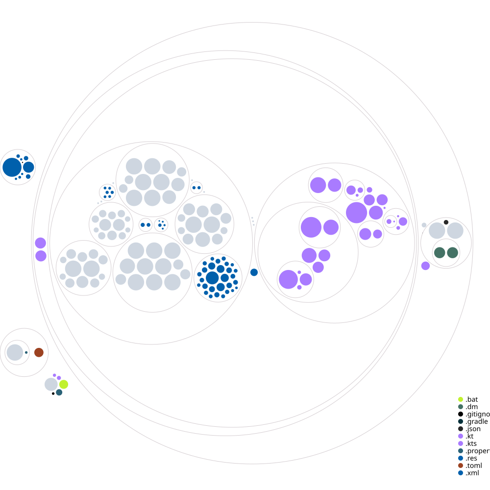

With this app you can group your most used apps and access them with just one gesture whenever you want.

### Access
You can get this app on play store ```link will be awailable soon```

### History
>This app was initially supposed to be an android launcher.
>
>built with the scope creep kincking in, It got bigger and bigger.

>This is one part of that extremely bloated android launcher used as a forground service.

## Some fun visualizations

### Code Volume Visualization


### Project Structure Visualization
<!---BETTER_FILES_TREE-->
```
┏ Angular-Apps━━━━━━━━━━━━━━━━━━━━━━━━━━━━━━━━━━━┓
┣┏ app━━━━━━━━━━━━━━━━━━━━━━━━━━━━━━━━━━━━━━━━━┓ ┃
┃┣┏ src━━━━━━━━━━━━━━━━━━━━━━━━━━━━━━━━━━━━━━┓ ┃ ┃
┃┃┣┏ main━━━━━━━━━━━━━━━━━━━━━━━━━━━━━━━━━━┓ ┃ ┃ ┃
┃┃┃┣Feature graphic.png                    ┃ ┃ ┃ ┃
┃┃┃┣ic_flat_app-playstore.png              ┃ ┃ ┃ ┃
┃┃┃┣ic_app-playstore.png                   ┃ ┃ ┃ ┃
┃┃┃┣AndroidManifest.xml                    ┃ ┃ ┃ ┃
┃┃┃┣┏ java━━━━━━━━━━━━━━━━━━━━━━━━━━━━━━━┓ ┃ ┃ ┃ ┃
┃┃┃┃┣┏ com━━━━━━━━━━━━━━━━━━━━━━━━━━━━━┓ ┃ ┃ ┃ ┃ ┃
┃┃┃┃┃┣┏ dhruv━━━━━━━━━━━━━━━━━━━━━━━━┓ ┃ ┃ ┃ ┃ ┃ ┃
┃┃┃┃┃┃┣┏ angularapps━━━━━━━━━━━━━━━┓ ┃ ┃ ┃ ┃ ┃ ┃ ┃
┃┃┃┃┃┃┃┣┏ data━━━━━━━━━━━┓         ┃ ┃ ┃ ┃ ┃ ┃ ┃ ┃
┃┃┃┃┃┃┃┃┣Breaks.kt       ┃         ┃ ┃ ┃ ┃ ┃ ┃ ┃ ┃
┃┃┃┃┃┃┃┃┣┏ models━━━━━┓  ┃         ┃ ┃ ┃ ┃ ┃ ┃ ┃ ┃
┃┃┃┃┃┃┃┃┃┣Position.kt ┃  ┃         ┃ ┃ ┃ ┃ ┃ ┃ ┃ ┃
┃┃┃┃┃┃┃┃┃┣Group.kt    ┃  ┃         ┃ ┃ ┃ ┃ ┃ ┃ ┃ ┃
┃┃┃┃┃┃┃┃┃┗━━━━━━━━━━━━┛  ┃         ┃ ┃ ┃ ┃ ┃ ┃ ┃ ┃
┃┃┃┃┃┃┃┃┣UserPrefImpl.kt ┃         ┃ ┃ ┃ ┃ ┃ ┃ ┃ ┃
┃┃┃┃┃┃┃┃┣UserPref.kt     ┃         ┃ ┃ ┃ ┃ ┃ ┃ ┃ ┃
┃┃┃┃┃┃┃┃┗━━━━━━━━━━━━━━━━┛         ┃ ┃ ┃ ┃ ┃ ┃ ┃ ┃
┃┃┃┃┃┃┃┣┏ apps━━━━━━━━━━━━━━━━━━━┓ ┃ ┃ ┃ ┃ ┃ ┃ ┃ ┃
┃┃┃┃┃┃┃┃┣AppsIconsPositioning.kt ┃ ┃ ┃ ┃ ┃ ┃ ┃ ┃ ┃
┃┃┃┃┃┃┃┃┣AppManager.kt           ┃ ┃ ┃ ┃ ┃ ┃ ┃ ┃ ┃
┃┃┃┃┃┃┃┃┗━━━━━━━━━━━━━━━━━━━━━━━━┛ ┃ ┃ ┃ ┃ ┃ ┃ ┃ ┃
┃┃┃┃┃┃┃┣┏ di━━━━━━━━━━┓            ┃ ┃ ┃ ┃ ┃ ┃ ┃ ┃
┃┃┃┃┃┃┃┃┣AppModule.kt ┃            ┃ ┃ ┃ ┃ ┃ ┃ ┃ ┃
┃┃┃┃┃┃┃┃┗━━━━━━━━━━━━━┛            ┃ ┃ ┃ ┃ ┃ ┃ ┃ ┃
┃┃┃┃┃┃┃┣┏ views━━━━━━━━━━━━━━━━━━┓ ┃ ┃ ┃ ┃ ┃ ┃ ┃ ┃
┃┃┃┃┃┃┃┃┣SliderView.kt           ┃ ┃ ┃ ┃ ┃ ┃ ┃ ┃ ┃
┃┃┃┃┃┃┃┃┣PositionedLayoutView.kt ┃ ┃ ┃ ┃ ┃ ┃ ┃ ┃ ┃
┃┃┃┃┃┃┃┃┣AppsAreaView.kt         ┃ ┃ ┃ ┃ ┃ ┃ ┃ ┃ ┃
┃┃┃┃┃┃┃┃┗━━━━━━━━━━━━━━━━━━━━━━━━┛ ┃ ┃ ┃ ┃ ┃ ┃ ┃ ┃
┃┃┃┃┃┃┃┣MainActivity.kt            ┃ ┃ ┃ ┃ ┃ ┃ ┃ ┃
┃┃┃┃┃┃┃┣┏ utils━━━━━━━━━━━━━┓      ┃ ┃ ┃ ┃ ┃ ┃ ┃ ┃
┃┃┃┃┃┃┃┃┣DrawablePainter.kt ┃      ┃ ┃ ┃ ┃ ┃ ┃ ┃ ┃
┃┃┃┃┃┃┃┃┗━━━━━━━━━━━━━━━━━━━┛      ┃ ┃ ┃ ┃ ┃ ┃ ┃ ┃
┃┃┃┃┃┃┃┣OverlayService.kt          ┃ ┃ ┃ ┃ ┃ ┃ ┃ ┃
┃┃┃┃┃┃┃┣┏ ui━━━━━━━━━┓             ┃ ┃ ┃ ┃ ┃ ┃ ┃ ┃
┃┃┃┃┃┃┃┃┣┏ theme━━━┓ ┃             ┃ ┃ ┃ ┃ ┃ ┃ ┃ ┃
┃┃┃┃┃┃┃┃┃┣Type.kt  ┃ ┃             ┃ ┃ ┃ ┃ ┃ ┃ ┃ ┃
┃┃┃┃┃┃┃┃┃┣Color.kt ┃ ┃             ┃ ┃ ┃ ┃ ┃ ┃ ┃ ┃
┃┃┃┃┃┃┃┃┃┣Theme.kt ┃ ┃             ┃ ┃ ┃ ┃ ┃ ┃ ┃ ┃
┃┃┃┃┃┃┃┃┃┗━━━━━━━━━┛ ┃             ┃ ┃ ┃ ┃ ┃ ┃ ┃ ┃
┃┃┃┃┃┃┃┃┗━━━━━━━━━━━━┛             ┃ ┃ ┃ ┃ ┃ ┃ ┃ ┃
┃┃┃┃┃┃┃┣┏ settings_app━━━━━━━━┓    ┃ ┃ ┃ ┃ ┃ ┃ ┃ ┃
┃┃┃┃┃┃┃┃┣┏ settings━━━━━┓     ┃    ┃ ┃ ┃ ┃ ┃ ┃ ┃ ┃
┃┃┃┃┃┃┃┃┃┣Settings.kt   ┃     ┃    ┃ ┃ ┃ ┃ ┃ ┃ ┃ ┃
┃┃┃┃┃┃┃┃┃┣SettingsVM.kt ┃     ┃    ┃ ┃ ┃ ┃ ┃ ┃ ┃ ┃
┃┃┃┃┃┃┃┃┃┗━━━━━━━━━━━━━━┛     ┃    ┃ ┃ ┃ ┃ ┃ ┃ ┃ ┃
┃┃┃┃┃┃┃┃┣┏ groups━━━━━━━━━━━┓ ┃    ┃ ┃ ┃ ┃ ┃ ┃ ┃ ┃
┃┃┃┃┃┃┃┃┃┣GroupsEditor.kt   ┃ ┃    ┃ ┃ ┃ ┃ ┃ ┃ ┃ ┃
┃┃┃┃┃┃┃┃┃┣GroupsManager.kt  ┃ ┃    ┃ ┃ ┃ ┃ ┃ ┃ ┃ ┃
┃┃┃┃┃┃┃┃┃┣GroupsEditorVM.kt ┃ ┃    ┃ ┃ ┃ ┃ ┃ ┃ ┃ ┃
┃┃┃┃┃┃┃┃┃┣GroupIcons.kt     ┃ ┃    ┃ ┃ ┃ ┃ ┃ ┃ ┃ ┃
┃┃┃┃┃┃┃┃┃┗━━━━━━━━━━━━━━━━━━┛ ┃    ┃ ┃ ┃ ┃ ┃ ┃ ┃ ┃
┃┃┃┃┃┃┃┃┣SettingsApp.kt       ┃    ┃ ┃ ┃ ┃ ┃ ┃ ┃ ┃
┃┃┃┃┃┃┃┃┣Home.kt              ┃    ┃ ┃ ┃ ┃ ┃ ┃ ┃ ┃
┃┃┃┃┃┃┃┃┣SettingsArt.kt       ┃    ┃ ┃ ┃ ┃ ┃ ┃ ┃ ┃
┃┃┃┃┃┃┃┃┗━━━━━━━━━━━━━━━━━━━━━┛    ┃ ┃ ┃ ┃ ┃ ┃ ┃ ┃
┃┃┃┃┃┃┃┣MyApp.kt                   ┃ ┃ ┃ ┃ ┃ ┃ ┃ ┃
┃┃┃┃┃┃┃┣AnimatedFloat.kt           ┃ ┃ ┃ ┃ ┃ ┃ ┃ ┃
┃┃┃┃┃┃┃┗━━━━━━━━━━━━━━━━━━━━━━━━━━━┛ ┃ ┃ ┃ ┃ ┃ ┃ ┃
┃┃┃┃┃┃┗━━━━━━━━━━━━━━━━━━━━━━━━━━━━━━┛ ┃ ┃ ┃ ┃ ┃ ┃
┃┃┃┃┃┗━━━━━━━━━━━━━━━━━━━━━━━━━━━━━━━━━┛ ┃ ┃ ┃ ┃ ┃
┃┃┃┃┗━━━━━━━━━━━━━━━━━━━━━━━━━━━━━━━━━━━━┛ ┃ ┃ ┃ ┃
┃┃┃┣g_ic_app-playstore.png                 ┃ ┃ ┃ ┃
┃┃┃┗━━━━━━━━━━━━━━━━━━━━━━━━━━━━━━━━━━━━━━━┛ ┃ ┃ ┃
┃┃┗━━━━━━━━━━━━━━━━━━━━━━━━━━━━━━━━━━━━━━━━━━┛ ┃ ┃
┃┣proguard-rules.pro                           ┃ ┃
┃┣build.gradle.kts                             ┃ ┃
┃┗━━━━━━━━━━━━━━━━━━━━━━━━━━━━━━━━━━━━━━━━━━━━━┛ ┃
┣README.md                                       ┃
┣gradlew.bat                                     ┃
┣┏ SS━━━━━━━━━━━━━━━━━━━━━━━━━━━━━━━┓            ┃
┃┣┏ phone━━━━━━━━━━━━━━━━━━━━━━━━━┓ ┃            ┃
┃┃┣Screenshot_20240813_232900.png ┃ ┃            ┃
┃┃┣Screenshot_20240813_233040.png ┃ ┃            ┃
┃┃┣Screenshot_20240813_232525.png ┃ ┃            ┃
┃┃┣Screenshot_20240813_232437.png ┃ ┃            ┃
┃┃┗━━━━━━━━━━━━━━━━━━━━━━━━━━━━━━━┛ ┃            ┃
┃┣┏ Tablet━━━━━━━━━━━━━━━━━━━━━━━━┓ ┃            ┃
┃┃┣Screenshot_20240813_234323.png ┃ ┃            ┃
┃┃┣Screenshot_20240813_234359.png ┃ ┃            ┃
┃┃┣Screenshot_20240813_234429.png ┃ ┃            ┃
┃┃┗━━━━━━━━━━━━━━━━━━━━━━━━━━━━━━━┛ ┃            ┃
┃┗━━━━━━━━━━━━━━━━━━━━━━━━━━━━━━━━━━┛            ┃
┣diagram.svg                                     ┃
┣build.gradle.kts                                ┃
┣gradlew                                         ┃
┣better-tree                                     ┃
┣gradle.properties                               ┃
┣settings.gradle.kts                             ┃
┗━━━━━━━━━━━━━━━━━━━━━━━━━━━━━━━━━━━━━━━━━━━━━━━━┛
```
